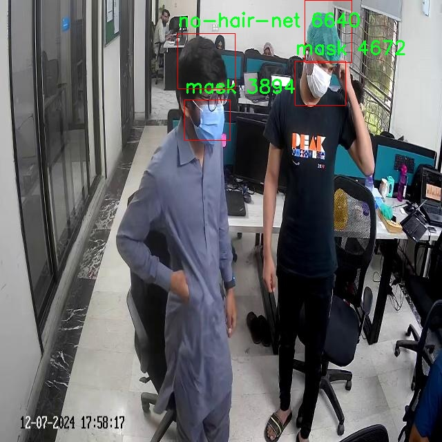

# 不戴口罩不戴安全帽检测检测系统源码分享
 # [一条龙教学YOLOV8标注好的数据集一键训练_70+全套改进创新点发刊_Web前端展示]

### 1.研究背景与意义

项目参考[AAAI Association for the Advancement of Artificial Intelligence](https://gitee.com/qunshansj/projects)

项目来源[AACV Association for the Advancement of Computer Vision](https://gitee.com/qunmasj/projects)

研究背景与意义

随着全球经济的快速发展和城市化进程的加快，工业安全和公共卫生问题日益突出。在这一背景下，确保工人和公众的安全与健康成为了社会各界关注的焦点。尤其是在疫情频发的当下，佩戴口罩已成为预防病毒传播的重要措施，而在工业环境中，佩戴安全帽则是保护工人生命安全的基本要求。因此，开发一种高效、智能的检测系统，以实时监测人们是否佩戴口罩和安全帽，具有重要的现实意义和应用价值。

传统的人工检查方式不仅效率低下，而且容易受到主观因素的影响，难以保证检测的准确性和一致性。近年来，计算机视觉和深度学习技术的迅猛发展为解决这一问题提供了新的思路。YOLO（You Only Look Once）系列目标检测算法因其高效性和实时性，已广泛应用于各类目标检测任务中。YOLOv8作为该系列的最新版本，具备更强的特征提取能力和更快的处理速度，适合用于复杂环境下的目标检测。因此，基于改进YOLOv8的检测系统，将为不戴口罩和不戴安全帽的监测提供一种创新的解决方案。

本研究将利用一个包含3400张标注图片的数据集，该数据集涵盖了五个类别，包括“hair-net”、“mask”、“no-hair-net”和“no-mask”。这些类别的设置不仅反映了实际场景中的多样性，也为模型的训练提供了丰富的样本支持。通过对这些数据的深入分析和处理，我们可以更好地理解不同场景下的佩戴情况，从而提升模型的检测精度和鲁棒性。

在实际应用中，该检测系统能够被广泛应用于工地、工厂、公共场所等多种环境中。通过实时监测，系统能够及时识别未佩戴口罩或安全帽的人员，并发出警报，提醒相关人员采取必要的安全措施。这不仅能够有效降低安全事故的发生率，还能在公共卫生危机中保护人们的健康。此外，该系统的推广应用也将推动智能监控技术在各行业的普及，促进社会安全管理的智能化和自动化进程。

综上所述，基于改进YOLOv8的不戴口罩不戴安全帽检测系统的研究，不仅具有重要的理论价值，还具备广泛的实际应用前景。通过提升检测技术的智能化水平，我们将能够更好地应对日益严峻的安全与健康挑战，为构建安全、健康的社会环境贡献力量。

### 2.图片演示


##### 注意：由于此博客编辑较早，上面“2.图片演示”和“3.视频演示”展示的系统图片或者视频可能为老版本，新版本在老版本的基础上升级如下：（实际效果以升级的新版本为准）

  （1）适配了YOLOV8的“目标检测”模型和“实例分割”模型，通过加载相应的权重（.pt）文件即可自适应加载模型。

  （2）支持“图片识别”、“视频识别”、“摄像头实时识别”三种识别模式。

  （3）支持“图片识别”、“视频识别”、“摄像头实时识别”三种识别结果保存导出，解决手动导出（容易卡顿出现爆内存）存在的问题，识别完自动保存结果并导出到tempDir中。

  （4）支持Web前端系统中的标题、背景图等自定义修改，后面提供修改教程。

  另外本项目提供训练的数据集和训练教程,暂不提供权重文件（best.pt）,需要您按照教程进行训练后实现图片演示和Web前端界面演示的效果。

### 3.视频演示

[3.1 视频演示](https://www.bilibili.com/video/BV11K4heWE6B/)

### 4.数据集信息展示

##### 4.1 本项目数据集详细数据（类别数＆类别名）

nc: 4
names: ['hair-net', 'mask', 'no-hair-net', 'no-mask']


##### 4.2 本项目数据集信息介绍

数据集信息展示

在构建改进YOLOv8的不戴口罩不戴安全帽检测系统的过程中，选择合适的数据集至关重要。本项目所采用的数据集名为“Annotated_pics”，该数据集专门为识别和分类与个人防护装备相关的场景而设计，涵盖了多种佩戴状态。数据集的类别数量为四个，具体类别包括：‘hair-net’（戴发网）、‘mask’（戴口罩）、‘no-hair-net’（未戴发网）和‘no-mask’（未戴口罩）。这些类别的设置不仅反映了在特定环境下对个人防护装备的要求，也为模型的训练提供了丰富的样本和多样化的场景。

在“Annotated_pics”数据集中，每个类别的样本均经过精确标注，确保了训练过程中数据的高质量和准确性。‘hair-net’类别包含了佩戴发网的个体，这在某些行业如食品加工和医疗环境中尤为重要。‘mask’类别则专注于佩戴口罩的个体，尤其是在疫情期间，口罩的佩戴成为了公共健康的重要措施。相对而言，‘no-hair-net’和‘no-mask’类别则代表了未佩戴相应防护装备的个体，这些样本的存在对于模型的学习至关重要，因为它们帮助系统识别和区分佩戴与不佩戴状态，从而提高检测的准确性和可靠性。

该数据集的多样性不仅体现在类别的划分上，还包括了样本的多样性。数据集中涵盖了不同性别、年龄和肤色的个体，确保了模型在实际应用中的泛化能力。此外，样本拍摄的环境也具有多样性，包括室内和室外场景、不同的光照条件以及各种背景，这些因素都可能影响检测系统的性能。因此，使用“Annotated_pics”数据集进行训练，能够有效提升YOLOv8模型在真实场景中的适应性和准确性。

在训练过程中，模型将通过反复学习这些标注样本，逐步提高对各类佩戴状态的识别能力。通过对比不同类别的特征，模型能够学习到佩戴和不佩戴防护装备的细微差别，从而在实际应用中快速、准确地进行检测。这一过程不仅依赖于数据集的丰富性和标注的准确性，还需要合理的训练策略和优化算法，以确保模型在面对复杂场景时仍能保持高效的检测性能。

综上所述，“Annotated_pics”数据集为改进YOLOv8的不戴口罩不戴安全帽检测系统提供了坚实的基础。通过对四个类别的深入学习，模型将能够在各种环境中有效识别佩戴状态，进而推动安全管理和公共健康的提升。数据集的设计和应用，体现了在人工智能领域中数据驱动的重要性，为未来的研究和应用提供了宝贵的参考。





### 5.全套项目环境部署视频教程（零基础手把手教学）

[5.1 环境部署教程链接（零基础手把手教学）](https://www.ixigua.com/7404473917358506534?logTag=c807d0cbc21c0ef59de5)


[5.2 安装Python虚拟环境创建和依赖库安装视频教程链接（零基础手把手教学）](https://www.ixigua.com/7404474678003106304?logTag=1f1041108cd1f708b01a)

### 6.手把手YOLOV8训练视频教程（零基础小白有手就能学会）

[6.1 手把手YOLOV8训练视频教程（零基础小白有手就能学会）](https://www.ixigua.com/7404477157818401292?logTag=d31a2dfd1983c9668658)

### 7.70+种全套YOLOV8创新点代码加载调参视频教程（一键加载写好的改进模型的配置文件）

[7.1 70+种全套YOLOV8创新点代码加载调参视频教程（一键加载写好的改进模型的配置文件）](https://www.ixigua.com/7404478314661806627?logTag=29066f8288e3f4eea3a4)

### 8.70+种全套YOLOV8创新点原理讲解（非科班也可以轻松写刊发刊，V10版本正在科研待更新）

由于篇幅限制，每个创新点的具体原理讲解就不一一展开，具体见下列网址中的创新点对应子项目的技术原理博客网址【Blog】：


[8.1 70+种全套YOLOV8创新点原理讲解链接](https://gitee.com/qunmasj/good)

### 9.系统功能展示（检测对象为举例，实际内容以本项目数据集为准）

图9.1.系统支持检测结果表格显示

  图9.2.系统支持置信度和IOU阈值手动调节

  图9.3.系统支持自定义加载权重文件best.pt(需要你通过步骤5中训练获得)

  图9.4.系统支持摄像头实时识别

  图9.5.系统支持图片识别

  图9.6.系统支持视频识别

  图9.7.系统支持识别结果文件自动保存

  图9.8.系统支持Excel导出检测结果数据


### 10.原始YOLOV8算法原理

原始YOLOv8算法原理

YOLOv8作为目标检测领域的最新代表，继承并发展了YOLO系列算法的优良传统，其设计理念和实现机制充分体现了现代深度学习技术的前沿进展。该算法的架构由输入层、主干网络、颈部网络和头部网络等主要组件构成，形成了一个高效的目标检测系统。首先，输入层负责接收图像数据，并将其缩放至指定的输入尺寸，以确保后续处理的一致性和有效性。这一过程不仅为模型提供了标准化的输入格式，还为后续的特征提取和分析奠定了基础。

在主干网络中，YOLOv8采用了深度卷积神经网络结构，通过一系列卷积操作对输入图像进行下采样，以提取出图像的高层次特征。每个卷积层都包含批归一化和SiLUR激活函数，这一设计不仅加速了训练过程，还提高了模型的非线性表达能力。值得注意的是，YOLOv8引入了C2f块，这一模块借鉴了YOLOv7中的E-ELAN结构，通过跨层分支连接来增强模型的梯度流动，从而有效改善检测结果。C2f块的设计使得特征提取过程更加灵活，能够更好地捕捉到图像中的重要信息。

主干网络的末尾，YOLOv8采用了SPPFl块，该模块通过三个最大池化层来处理多尺度特征，进一步增强了网络的特征抽象能力。这一设计使得YOLOv8能够在不同尺度上对目标进行有效检测，提升了模型在复杂场景下的表现。接下来，颈部网络通过FPNS（特征金字塔网络）和PAN（路径聚合网络）结构，融合了来自不同尺度特征图的信息。这一过程不仅增强了特征的表达能力，还为后续的目标检测提供了丰富的上下文信息。

在头部网络中，YOLOv8采用了解耦的检测头，设计了两个并行的卷积分支，分别计算回归和类别的损失。这一创新设计使得模型在进行目标定位和分类时能够更加高效，避免了传统耦合头可能带来的信息干扰。通过这种方式，YOLOv8能够在保证高精度的同时，显著提高检测速度。

与之前的YOLO版本相比，YOLOv8在多个方面进行了优化和改进，尤其是在精度和速度的平衡上。其深度卷积神经网络结构的引入，使得模型在处理复杂场景时能够更好地捕捉细节信息，从而提升了目标检测的准确性。同时，YOLOv8还引入了多尺度训练和测试的策略，进一步增强了模型在不同应用场景下的适应能力。这些改进使得YOLOv8在智能监控、自动驾驶、人脸识别等领域的应用潜力大大增强。

值得一提的是，YOLOv8的轻量化版本YOLOv8n在设计上更为精简，特别是在骨干特征提取网络层中使用了更轻量化的C2F模块，替代了原有的C3模块。这一调整不仅减少了模型的计算复杂度，还提升了其在资源受限环境下的应用能力。特征融合层的优化，结合BiFPN网络的引入，使得YOLOv8n在提取不同尺度特征信息时更加高效，进一步提升了模型的整体性能。

总的来说，YOLOv8算法通过一系列创新的设计和优化，不仅在目标检测的精度和速度上取得了显著提升，还为未来的研究和应用提供了新的思路和方向。其灵活的架构和高效的特征提取能力，使得YOLOv8成为了目标检测领域的一项重要技术进展，必将在各类实际应用中发挥越来越重要的作用。


### 11.项目核心源码讲解（再也不用担心看不懂代码逻辑）

#### 11.1 ui.py

以下是经过简化和注释的核心代码部分：

```python
import sys
import subprocess
from QtFusion.path import abs_path

def run_script(script_path):
    """
    使用当前 Python 环境运行指定的脚本。

    Args:
        script_path (str): 要运行的脚本路径
    """
    # 获取当前 Python 解释器的路径
    python_path = sys.executable

    # 构建运行命令，使用 streamlit 运行指定的脚本
    command = f'"{python_path}" -m streamlit run "{script_path}"'

    # 执行命令并等待其完成
    result = subprocess.run(command, shell=True)
    
    # 检查命令执行结果，如果返回码不为0，表示出错
    if result.returncode != 0:
        print("脚本运行出错。")

# 主程序入口
if __name__ == "__main__":
    # 获取脚本的绝对路径
    script_path = abs_path("web.py")

    # 运行指定的脚本
    run_script(script_path)
```

### 代码注释说明：
1. **导入模块**：
   - `sys`：用于获取当前 Python 解释器的路径。
   - `subprocess`：用于执行外部命令。
   - `abs_path`：从 `QtFusion.path` 导入的函数，用于获取文件的绝对路径。

2. **`run_script` 函数**：
   - 功能：接受一个脚本路径作为参数，并使用当前 Python 环境运行该脚本。
   - 使用 `sys.executable` 获取当前 Python 解释器的路径，以确保使用正确的 Python 环境。
   - 构建命令字符串，使用 `streamlit` 运行指定的脚本。
   - 使用 `subprocess.run` 执行命令，并检查返回码以判断脚本是否成功运行。

3. **主程序入口**：
   - 通过 `if __name__ == "__main__":` 确保代码只有在直接运行时才会执行。
   - 使用 `abs_path` 获取 `web.py` 的绝对路径，并调用 `run_script` 函数运行该脚本。

这个文件名为 `ui.py`，它的主要功能是通过当前的 Python 环境来运行一个指定的脚本，具体来说是运行一个名为 `web.py` 的脚本。代码中首先导入了一些必要的模块，包括 `sys`、`os` 和 `subprocess`，这些模块提供了与系统交互的功能。

在 `run_script` 函数中，首先获取当前 Python 解释器的路径，这通过 `sys.executable` 实现。接着，构建一个命令字符串，这个命令用于运行 `streamlit`，并指定要执行的脚本路径。这里使用了 `-m streamlit run` 来启动 Streamlit 应用。

随后，使用 `subprocess.run` 方法来执行这个命令。`shell=True` 参数允许在 shell 中执行命令。执行完命令后，检查返回的结果码，如果结果码不为零，表示脚本运行出错，此时会打印出错误信息。

在文件的最后部分，使用 `if __name__ == "__main__":` 来确保当该文件作为主程序运行时才会执行下面的代码。这里指定了要运行的脚本路径，即 `web.py`，并调用 `run_script` 函数来执行它。

总的来说，这个程序的作用是方便地启动一个 Streamlit 应用，具体的应用逻辑则在 `web.py` 文件中实现。

#### 11.2 70+种YOLOv8算法改进源码大全和调试加载训练教程（非必要）\ultralytics\models\yolo\segment\__init__.py

```python
# Ultralytics YOLO 🚀, AGPL-3.0 license

# 从当前模块导入SegmentationPredictor、SegmentationTrainer和SegmentationValidator类
from .predict import SegmentationPredictor
from .train import SegmentationTrainer
from .val import SegmentationValidator

# 定义模块的公共接口，指定可以被外部访问的类
__all__ = 'SegmentationPredictor', 'SegmentationTrainer', 'SegmentationValidator'
```

### 代码详细注释：
1. **导入模块**：
   - `from .predict import SegmentationPredictor`：从当前包的`predict`模块中导入`SegmentationPredictor`类，通常用于图像分割的预测功能。
   - `from .train import SegmentationTrainer`：从当前包的`train`模块中导入`SegmentationTrainer`类，负责训练分割模型。
   - `from .val import SegmentationValidator`：从当前包的`val`模块中导入`SegmentationValidator`类，用于验证分割模型的性能。

2. **定义公共接口**：
   - `__all__`是一个特殊变量，用于定义当使用`from module import *`时，哪些名称是可以被导入的。在这里，指定了`SegmentationPredictor`、`SegmentationTrainer`和`SegmentationValidator`这三个类可以被外部访问。这样做有助于控制模块的可见性，避免不必要的名称冲突。

这个程序文件是一个Python模块的初始化文件，主要用于Ultralytics YOLO（You Only Look Once）算法的分割（Segmentation）功能。文件的开头包含了一条版权声明，表明该代码遵循AGPL-3.0许可证，这意味着用户可以自由使用、修改和分发该代码，但需要遵循相应的开源协议。

在文件中，首先通过相对导入的方式引入了三个类：`SegmentationPredictor`、`SegmentationTrainer`和`SegmentationValidator`。这些类分别负责不同的功能：`SegmentationPredictor`用于进行图像分割的预测，`SegmentationTrainer`用于训练分割模型，而`SegmentationValidator`则用于验证模型的性能。

最后，`__all__`变量被定义为一个元组，包含了这三个类的名称。这意味着当使用`from module import *`语句时，只会导入这些指定的类，从而控制模块的公共接口，避免不必要的名称冲突或混淆。

总体而言，这个文件是Ultralytics YOLO分割模块的核心部分之一，通过组织和管理相关的类，使得用户可以方便地进行图像分割的预测、训练和验证。

#### 11.3 70+种YOLOv8算法改进源码大全和调试加载训练教程（非必要）\ultralytics\trackers\track.py

以下是经过简化和注释的核心代码部分：

```python
# 导入必要的库
from functools import partial
import torch
from ultralytics.utils import IterableSimpleNamespace, yaml_load
from ultralytics.utils.checks import check_yaml
from .bot_sort import BOTSORT
from .byte_tracker import BYTETracker

# 定义跟踪器映射，便于根据类型选择相应的跟踪器
TRACKER_MAP = {'bytetrack': BYTETracker, 'botsort': BOTSORT}

def on_predict_start(predictor, persist=False):
    """
    在预测开始时初始化对象跟踪器。

    参数:
        predictor (object): 预测器对象，用于初始化跟踪器。
        persist (bool, optional): 如果跟踪器已存在，是否保持其状态。默认为 False。

    异常:
        AssertionError: 如果 tracker_type 不是 'bytetrack' 或 'botsort'。
    """
    # 如果预测器已有跟踪器且选择保持状态，则直接返回
    if hasattr(predictor, 'trackers') and persist:
        return
    
    # 检查并加载跟踪器配置
    tracker = check_yaml(predictor.args.tracker)
    cfg = IterableSimpleNamespace(**yaml_load(tracker))
    
    # 确保跟踪器类型是支持的类型
    assert cfg.tracker_type in ['bytetrack', 'botsort'], \
        f"只支持 'bytetrack' 和 'botsort'，但得到的是 '{cfg.tracker_type}'"
    
    # 初始化跟踪器列表
    trackers = []
    for _ in range(predictor.dataset.bs):  # 遍历每个批次
        # 根据配置创建相应的跟踪器实例
        tracker = TRACKER_MAP[cfg.tracker_type](args=cfg, frame_rate=30)
        trackers.append(tracker)  # 将跟踪器添加到列表中
    
    predictor.trackers = trackers  # 将跟踪器列表赋值给预测器

def on_predict_postprocess_end(predictor):
    """后处理检测到的框并更新对象跟踪。"""
    bs = predictor.dataset.bs  # 批次大小
    im0s = predictor.batch[1]  # 获取原始图像数据
    for i in range(bs):
        det = predictor.results[i].boxes.cpu().numpy()  # 获取检测结果
        if len(det) == 0:  # 如果没有检测到物体，跳过
            continue
        
        # 更新跟踪器并获取跟踪结果
        tracks = predictor.trackers[i].update(det, im0s[i])
        if len(tracks) == 0:  # 如果没有跟踪到物体，跳过
            continue
        
        idx = tracks[:, -1].astype(int)  # 获取有效的索引
        predictor.results[i] = predictor.results[i][idx]  # 更新检测结果
        predictor.results[i].update(boxes=torch.as_tensor(tracks[:, :-1]))  # 更新框信息

def register_tracker(model, persist):
    """
    将跟踪回调注册到模型，以便在预测期间进行对象跟踪。

    参数:
        model (object): 要注册跟踪回调的模型对象。
        persist (bool): 如果跟踪器已存在，是否保持其状态。
    """
    # 注册预测开始时的回调
    model.add_callback('on_predict_start', partial(on_predict_start, persist=persist))
    # 注册后处理结束时的回调
    model.add_callback('on_predict_postprocess_end', on_predict_postprocess_end)
```

### 代码说明：
1. **导入模块**：导入所需的库和模块，包括跟踪器类和工具函数。
2. **跟踪器映射**：定义一个字典，用于根据跟踪器类型选择相应的跟踪器类。
3. **`on_predict_start` 函数**：在预测开始时初始化跟踪器。它会检查是否已经存在跟踪器，如果没有，则根据配置文件创建新的跟踪器实例。
4. **`on_predict_postprocess_end` 函数**：在预测后处理阶段更新检测结果。它会调用跟踪器更新方法，并根据跟踪结果更新预测器的结果。
5. **`register_tracker` 函数**：将跟踪相关的回调函数注册到模型中，以便在预测过程中自动调用。

这个程序文件是一个用于YOLO（You Only Look Once）算法的目标跟踪模块，主要实现了在目标检测过程中对目标进行跟踪的功能。文件中使用了两个主要的跟踪算法：BYTETracker和BOTSORT。以下是对代码的详细讲解。

首先，文件引入了一些必要的库和模块，包括`torch`和一些来自`ultralytics`的工具函数。`TRACKER_MAP`字典将跟踪算法的名称映射到相应的类，方便后续根据配置选择使用的跟踪算法。

`on_predict_start`函数用于在预测开始时初始化跟踪器。它接受一个预测器对象和一个可选的布尔参数`persist`，用于指示是否在跟踪器已存在时保持其状态。函数首先检查预测器是否已经有跟踪器，如果有且`persist`为真，则直接返回。接着，它会检查配置文件中的跟踪器类型，确保只支持'bytetrack'和'botsort'这两种类型。然后，函数为每个批次创建相应的跟踪器实例，并将其存储在预测器的`trackers`属性中。

`on_predict_postprocess_end`函数在检测框的后处理结束时被调用，用于更新检测结果并进行目标跟踪。它首先获取当前批次的大小和输入图像。对于每个样本，函数提取检测到的框，如果没有检测到框，则跳过该样本。接着，调用相应的跟踪器的`update`方法来更新跟踪信息，并获取新的跟踪结果。如果有有效的跟踪结果，函数会根据跟踪结果的索引更新预测结果，并将新的框信息更新到预测结果中。

最后，`register_tracker`函数用于将跟踪回调注册到模型中，以便在预测过程中能够调用跟踪功能。它接受模型对象和一个布尔参数`persist`，并使用`add_callback`方法将`on_predict_start`和`on_predict_postprocess_end`两个回调函数注册到模型中。

总体而言，这段代码的主要功能是为YOLO模型提供目标跟踪的能力，通过不同的跟踪算法实现对检测到的目标进行持续跟踪，并在预测过程中动态更新检测结果。

#### 11.4 70+种YOLOv8算法改进源码大全和调试加载训练教程（非必要）\ultralytics\models\yolo\classify\predict.py

以下是经过简化和注释的核心代码部分：

```python
import torch
from ultralytics.engine.predictor import BasePredictor
from ultralytics.engine.results import Results
from ultralytics.utils import DEFAULT_CFG, ops

class ClassificationPredictor(BasePredictor):
    """
    ClassificationPredictor类用于基于分类模型进行预测。
    该类继承自BasePredictor类。
    """

    def __init__(self, cfg=DEFAULT_CFG, overrides=None, _callbacks=None):
        """初始化ClassificationPredictor，将任务设置为'分类'。"""
        super().__init__(cfg, overrides, _callbacks)  # 调用父类构造函数
        self.args.task = 'classify'  # 设置任务类型为分类

    def preprocess(self, img):
        """将输入图像转换为模型兼容的数据类型。"""
        # 如果输入不是torch.Tensor类型，则进行转换
        if not isinstance(img, torch.Tensor):
            img = torch.stack([self.transforms(im) for im in img], dim=0)  # 应用预处理变换并堆叠
        # 将图像数据移动到模型所在的设备（CPU或GPU）
        img = (img if isinstance(img, torch.Tensor) else torch.from_numpy(img)).to(self.model.device)
        # 根据模型的精度设置，将数据类型转换为float16或float32
        return img.half() if self.model.fp16 else img.float()  # uint8转换为fp16/32

    def postprocess(self, preds, img, orig_imgs):
        """对预测结果进行后处理，返回Results对象。"""
        # 如果原始图像不是列表，则将其转换为numpy数组
        if not isinstance(orig_imgs, list):
            orig_imgs = ops.convert_torch2numpy_batch(orig_imgs)

        results = []  # 存储结果的列表
        for i, pred in enumerate(preds):  # 遍历每个预测结果
            orig_img = orig_imgs[i]  # 获取对应的原始图像
            img_path = self.batch[0][i]  # 获取图像路径
            # 创建Results对象并添加到结果列表中
            results.append(Results(orig_img, path=img_path, names=self.model.names, probs=pred))
        return results  # 返回结果列表
```

### 代码说明：
1. **导入必要的库**：导入PyTorch和Ultralytics库中的必要模块。
2. **ClassificationPredictor类**：该类用于图像分类任务，继承自`BasePredictor`。
3. **初始化方法**：在初始化时设置任务类型为分类，并调用父类的构造函数。
4. **预处理方法**：将输入图像转换为模型可以接受的格式，包括类型转换和设备迁移。
5. **后处理方法**：将模型的预测结果与原始图像结合，生成包含预测信息的`Results`对象。

这个程序文件是一个用于图像分类的预测器，属于Ultralytics YOLO系列的实现。它继承自`BasePredictor`类，专门用于基于分类模型的预测。文件中包含了一些重要的功能和方法，下面对其进行逐步说明。

首先，文件导入了必要的库，包括`torch`和Ultralytics的相关模块。`torch`是PyTorch深度学习框架的核心库，而`BasePredictor`和`Results`则是Ultralytics框架中用于处理预测和结果的基础类。

`ClassificationPredictor`类的构造函数`__init__`接受三个参数：`cfg`、`overrides`和`_callbacks`。其中，`cfg`参数默认为`DEFAULT_CFG`，用于配置模型的默认设置。`overrides`可以用来覆盖默认配置，而`_callbacks`则用于传递回调函数。构造函数中调用了父类的初始化方法，并将任务类型设置为“classify”，表明该预测器的主要功能是进行分类。

`preprocess`方法用于对输入图像进行预处理，以便将其转换为模型所需的数据类型。该方法首先检查输入是否为`torch.Tensor`类型，如果不是，则通过`self.transforms`对每张图像进行转换，并将它们堆叠成一个批次。接着，将图像移动到模型所在的设备上（如GPU），并根据模型的精度设置将图像转换为半精度（fp16）或单精度（fp32）。

`postprocess`方法则负责对模型的预测结果进行后处理，以返回`Results`对象。该方法首先检查原始图像是否为列表类型，如果不是，则将其转换为NumPy数组。接下来，方法遍历每个预测结果，将原始图像、图像路径、模型名称和预测概率封装到`Results`对象中，并将其添加到结果列表中，最终返回该列表。

总体而言，这个文件实现了一个用于图像分类的预测器，提供了图像预处理和后处理的功能，能够将输入图像转换为模型可以处理的格式，并将预测结果以结构化的方式返回。通过示例代码，用户可以看到如何使用该预测器进行分类任务。

#### 11.5 code\ultralytics\models\nas\predict.py

以下是代码中最核心的部分，并附上详细的中文注释：

```python
import torch
from ultralytics.engine.predictor import BasePredictor
from ultralytics.engine.results import Results
from ultralytics.utils import ops

class NASPredictor(BasePredictor):
    """
    Ultralytics YOLO NAS 预测器，用于目标检测。

    该类扩展了 Ultralytics 引擎中的 `BasePredictor`，负责对 YOLO NAS 模型生成的原始预测结果进行后处理。
    它应用了非极大值抑制（NMS）等操作，并将边界框缩放以适应原始图像的尺寸。
    """

    def postprocess(self, preds_in, img, orig_imgs):
        """对预测结果进行后处理，并返回 Results 对象的列表。"""

        # 将预测结果中的边界框转换为 (x_center, y_center, width, height) 格式
        boxes = ops.xyxy2xywh(preds_in[0][0])
        
        # 将边界框和类别分数拼接在一起，并调整维度
        preds = torch.cat((boxes, preds_in[0][1]), -1).permute(0, 2, 1)

        # 应用非极大值抑制，过滤掉重叠的边界框
        preds = ops.non_max_suppression(
            preds,
            self.args.conf,          # 置信度阈值
            self.args.iou,           # IOU 阈值
            agnostic=self.args.agnostic_nms,  # 是否进行类别无关的 NMS
            max_det=self.args.max_det,          # 最大检测数量
            classes=self.args.classes,           # 选择的类别
        )

        # 如果输入的原始图像不是列表，则将其转换为 numpy 数组
        if not isinstance(orig_imgs, list):
            orig_imgs = ops.convert_torch2numpy_batch(orig_imgs)

        results = []
        # 遍历每个预测结果
        for i, pred in enumerate(preds):
            orig_img = orig_imgs[i]  # 获取对应的原始图像
            
            # 将预测的边界框缩放到原始图像的尺寸
            pred[:, :4] = ops.scale_boxes(img.shape[2:], pred[:, :4], orig_img.shape)
            
            # 获取当前图像的路径
            img_path = self.batch[0][i]
            
            # 将结果添加到结果列表中
            results.append(Results(orig_img, path=img_path, names=self.model.names, boxes=pred))
        
        return results  # 返回处理后的结果列表
```

### 代码说明：
1. **导入必要的库**：导入 `torch` 和 Ultralytics 的相关模块。
2. **类定义**：`NASPredictor` 类继承自 `BasePredictor`，用于 YOLO NAS 模型的后处理。
3. **后处理方法**：`postprocess` 方法接收原始预测结果、输入图像和原始图像，进行以下操作：
   - 将边界框格式转换为中心点和宽高格式。
   - 拼接边界框和类别分数，并进行维度调整。
   - 应用非极大值抑制（NMS）以去除重叠的边界框。
   - 如果原始图像不是列表，则转换为 numpy 数组。
   - 遍历每个预测结果，缩放边界框到原始图像尺寸，并创建 `Results` 对象。
4. **返回结果**：返回包含所有处理后结果的列表。

这个程序文件是Ultralytics YOLO NAS模型的预测模块，主要用于目标检测。它继承自Ultralytics引擎中的`BasePredictor`类，负责对YOLO NAS模型生成的原始预测结果进行后处理。后处理的步骤包括非极大值抑制（NMS）和将边界框缩放到原始图像的尺寸。

在这个类中，`postprocess`方法是核心功能。它接收原始预测结果、输入图像和原始图像作为参数。首先，它将预测框的坐标从xyxy格式转换为xywh格式，并将预测框与对应的类分数进行拼接。接着，调用非极大值抑制函数来过滤掉重叠的预测框，保留最有可能的检测结果。

如果输入的原始图像不是列表形式，而是一个PyTorch张量，则会将其转换为NumPy数组。随后，程序会遍历每个预测结果，将边界框的坐标缩放到原始图像的尺寸，并将结果封装成`Results`对象，最后返回这些结果。

需要注意的是，这个类通常不会被直接实例化，而是在`NAS`类内部使用。这个设计使得用户可以通过`NAS`类来获取预测器，并进行相应的预测和后处理操作。

#### 11.6 train.py

以下是经过简化和注释的核心代码部分，主要集中在训练数据集的构建、数据加载器的获取、模型的设置和训练过程中的一些功能：

```python
import random
import numpy as np
import torch.nn as nn
from ultralytics.data import build_dataloader, build_yolo_dataset
from ultralytics.engine.trainer import BaseTrainer
from ultralytics.models import yolo
from ultralytics.nn.tasks import DetectionModel
from ultralytics.utils import LOGGER, RANK
from ultralytics.utils.torch_utils import de_parallel, torch_distributed_zero_first

class DetectionTrainer(BaseTrainer):
    """
    基于检测模型的训练类，继承自BaseTrainer类。
    """

    def build_dataset(self, img_path, mode="train", batch=None):
        """
        构建YOLO数据集。

        参数:
            img_path (str): 包含图像的文件夹路径。
            mode (str): 模式，`train`表示训练模式，`val`表示验证模式。
            batch (int, optional): 批量大小，仅用于`rect`模式。默认为None。
        """
        gs = max(int(de_parallel(self.model).stride.max() if self.model else 0), 32)  # 获取模型的最大步幅
        return build_yolo_dataset(self.args, img_path, batch, self.data, mode=mode, rect=mode == "val", stride=gs)

    def get_dataloader(self, dataset_path, batch_size=16, rank=0, mode="train"):
        """构造并返回数据加载器。"""
        assert mode in ["train", "val"]  # 确保模式有效
        with torch_distributed_zero_first(rank):  # 在分布式训练中，确保数据集只初始化一次
            dataset = self.build_dataset(dataset_path, mode, batch_size)  # 构建数据集
        shuffle = mode == "train"  # 训练模式下打乱数据
        workers = self.args.workers if mode == "train" else self.args.workers * 2  # 根据模式设置工作线程数
        return build_dataloader(dataset, batch_size, workers, shuffle, rank)  # 返回数据加载器

    def preprocess_batch(self, batch):
        """对图像批次进行预处理，包括缩放和转换为浮点数。"""
        batch["img"] = batch["img"].to(self.device, non_blocking=True).float() / 255  # 将图像转换为浮点数并归一化
        if self.args.multi_scale:  # 如果启用多尺度
            imgs = batch["img"]
            sz = (
                random.randrange(self.args.imgsz * 0.5, self.args.imgsz * 1.5 + self.stride)
                // self.stride
                * self.stride
            )  # 随机选择新的尺寸
            sf = sz / max(imgs.shape[2:])  # 计算缩放因子
            if sf != 1:  # 如果需要缩放
                ns = [
                    math.ceil(x * sf / self.stride) * self.stride for x in imgs.shape[2:]
                ]  # 计算新的形状
                imgs = nn.functional.interpolate(imgs, size=ns, mode="bilinear", align_corners=False)  # 进行插值缩放
            batch["img"] = imgs  # 更新批次图像
        return batch

    def set_model_attributes(self):
        """设置模型的属性，包括类别数量和名称。"""
        self.model.nc = self.data["nc"]  # 将类别数量附加到模型
        self.model.names = self.data["names"]  # 将类别名称附加到模型
        self.model.args = self.args  # 将超参数附加到模型

    def get_model(self, cfg=None, weights=None, verbose=True):
        """返回YOLO检测模型。"""
        model = DetectionModel(cfg, nc=self.data["nc"], verbose=verbose and RANK == -1)  # 创建检测模型
        if weights:
            model.load(weights)  # 加载权重
        return model
```

### 代码说明：
1. **build_dataset**: 该方法用于构建YOLO数据集，接收图像路径、模式和批量大小作为参数。
2. **get_dataloader**: 构造数据加载器，确保在分布式训练中只初始化一次数据集，并根据模式设置是否打乱数据。
3. **preprocess_batch**: 对图像批次进行预处理，包括归一化和可选的多尺度处理。
4. **set_model_attributes**: 设置模型的类别数量和名称等属性。
5. **get_model**: 返回一个YOLO检测模型，并可选择加载预训练权重。

这些方法是训练YOLO模型的核心部分，负责数据的准备和模型的配置。

这个程序文件 `train.py` 是一个用于训练 YOLO（You Only Look Once）目标检测模型的实现，继承自 `BaseTrainer` 类。程序的主要功能是构建数据集、处理数据、设置模型属性、获取模型和验证器，以及绘制训练过程中的一些可视化结果。

首先，程序导入了一些必要的库和模块，包括数学运算、随机数生成、深度学习相关的 PyTorch 库，以及 Ultralytics 提供的 YOLO 相关的工具和函数。

`DetectionTrainer` 类是这个文件的核心，负责训练目标检测模型。它提供了多个方法来实现不同的功能。`build_dataset` 方法用于构建 YOLO 数据集，接受图像路径、模式（训练或验证）和批量大小作为参数。它使用 `build_yolo_dataset` 函数来生成数据集，并根据模型的步幅调整图像的尺寸。

`get_dataloader` 方法用于构建数据加载器，确保在分布式训练中只初始化一次数据集。它根据模式选择是否打乱数据，并设置工作线程的数量。`preprocess_batch` 方法对输入的图像批次进行预处理，包括缩放和转换为浮点数格式。

`set_model_attributes` 方法用于设置模型的属性，包括类别数量和类别名称等。`get_model` 方法返回一个 YOLO 检测模型，并可以加载预训练的权重。`get_validator` 方法返回一个用于验证模型性能的验证器。

在训练过程中，损失函数的计算和记录也很重要，`label_loss_items` 方法返回一个包含训练损失项的字典，方便后续分析。`progress_string` 方法生成一个格式化的字符串，用于显示训练进度，包括当前的轮次、GPU 内存使用情况、损失值等信息。

此外，程序还提供了一些可视化功能，包括 `plot_training_samples` 方法用于绘制训练样本及其标注，`plot_metrics` 方法用于绘制训练过程中的指标，`plot_training_labels` 方法则创建一个带有标注的训练图，帮助用户更好地理解模型的训练效果。

总体而言，这个文件提供了一个完整的框架，用于训练 YOLO 模型，涵盖了数据处理、模型构建、训练过程监控和结果可视化等多个方面。

### 12.系统整体结构（节选）

### 整体功能和构架概括

该程序库是一个完整的目标检测和图像分类框架，基于YOLO（You Only Look Once）算法，特别是YOLOv8版本。它包含多个模块，分别负责不同的功能，如模型训练、预测、目标跟踪、图像分割和分类等。整体架构设计良好，模块化程度高，使得用户可以方便地进行模型的训练、评估和推理。

主要功能包括：
- **数据处理**：提供数据集构建和数据加载功能，支持多种数据格式。
- **模型训练**：实现了模型的训练过程，包括损失计算、优化和进度监控。
- **预测和后处理**：对输入图像进行预测，并对结果进行后处理，如非极大值抑制（NMS）。
- **目标跟踪**：支持对检测到的目标进行跟踪，提供不同的跟踪算法。
- **图像分割和分类**：实现了图像分割和分类的功能，扩展了YOLO模型的应用场景。
- **可视化工具**：提供训练过程中的可视化工具，帮助用户理解模型性能。

### 文件功能整理表

| 文件路径                                                                                                     | 功能描述                                                                                     |
|------------------------------------------------------------------------------------------------------------|---------------------------------------------------------------------------------------------|
| `ui.py`                                                                                                    | 启动Streamlit应用，运行YOLOv8相关的Web界面。                                                |
| `ultralytics/models/yolo/segment/__init__.py`                                                             | 初始化分割模块，导入分割预测器、训练器和验证器。                                            |
| `ultralytics/trackers/track.py`                                                                           | 实现目标跟踪功能，支持BYTETracker和BOTSORT算法，处理预测结果并更新跟踪信息。               |
| `ultralytics/models/yolo/classify/predict.py`                                                             | 实现图像分类的预测器，提供图像预处理和后处理功能。                                          |
| `ultralytics/models/nas/predict.py`                                                                       | 处理YOLO NAS模型的预测，进行后处理和非极大值抑制。                                          |
| `train.py`                                                                                                | 负责训练YOLO模型，构建数据集、设置模型属性、监控训练过程并提供可视化工具。                 |
| `ultralytics/utils/autobatch.py`                                                                          | 实现自动批处理功能，优化数据加载和训练过程。                                                |
| `ultralytics/nn/extra_modules/head.py`                                                                    | 定义YOLO模型的头部结构，处理输出层的设计和实现。                                            |
| `ultralytics/__init__.py`                                                                                 | 初始化Ultralytics模块，设置包的公共接口。                                                  |
| `ultralytics/trackers/byte_tracker.py`                                                                    | 实现BYTETracker算法的具体功能，处理目标跟踪的逻辑。                                        |
| `ultralytics/solutions/heatmap.py`                                                                        | 提供热图生成和处理功能，可能用于可视化模型的注意力区域。                                    |
| `ultralytics/utils/files.py`                                                                               | 提供文件操作相关的工具函数，如文件读取、写入和路径处理。                                    |
| `ultralytics/models/yolo/segment/predict.py`                                                              | 实现YOLO分割模型的预测功能，处理分割任务的输入和输出。                                     |

这个表格概述了每个文件的主要功能，帮助用户快速理解整个项目的结构和各个模块的作用。

注意：由于此博客编辑较早，上面“11.项目核心源码讲解（再也不用担心看不懂代码逻辑）”中部分代码可能会优化升级，仅供参考学习，完整“训练源码”、“Web前端界面”和“70+种创新点源码”以“13.完整训练+Web前端界面+70+种创新点源码、数据集获取”的内容为准。

### 13.完整训练+Web前端界面+70+种创新点源码、数据集获取


# [下载链接：https://mbd.pub/o/bread/ZpuTmJpt](https://mbd.pub/o/bread/ZpuTmJpt)